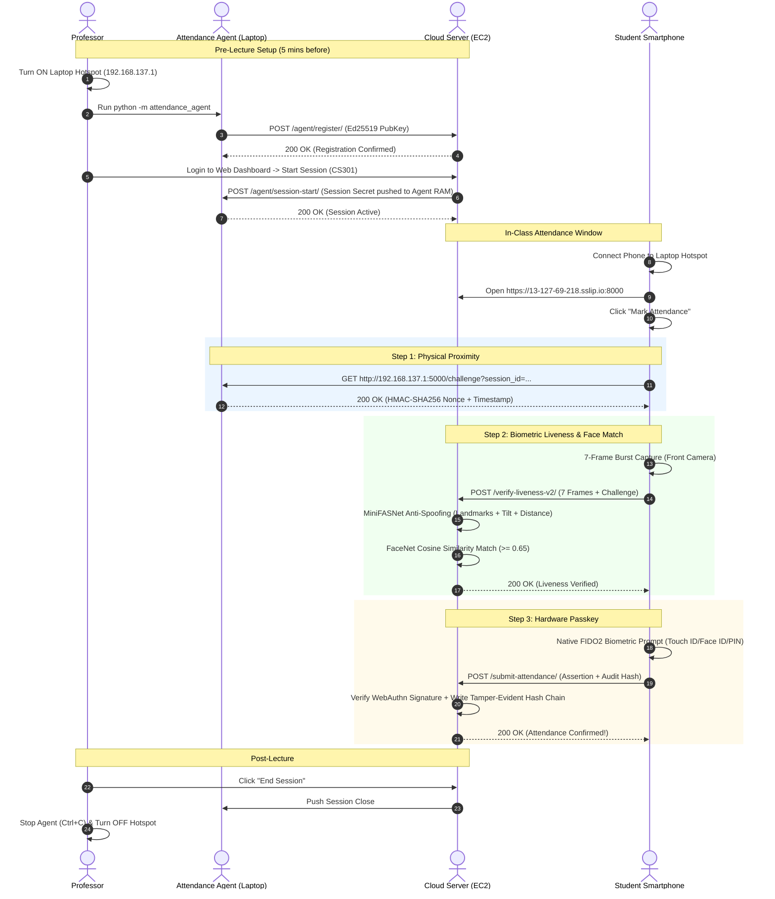

# Complete End-to-End Execution Guide — Secure Attendance System (V3 Production Architecture)

This document is the **master A-to-Z operational manual** for the Secure Attendance Platform. It covers local development, cloud provisioning (AWS EC2 / Ubuntu), Docker lifecycle management, cloud startup and shutdown, phone configuration, face & anti-spoofing pipeline operations, code recompilation, and complete troubleshooting.

---

## Table of Contents
1. [Architecture Overview & Security Blueprint](#1-architecture-overview--security-blueprint)
2. [Local Setup (Professor Laptop)](#2-local-setup-professor-laptop)
3. [Cloud Setup: AWS EC2 Ubuntu Deployment (A-Z)](#3-cloud-setup-aws-ec2-ubuntu-deployment-a-z)
4. [Cloud Lifecycle: Turning ON & Turning OFF Cloud](#4-cloud-lifecycle-turning-on--turning-off-cloud)
5. [Docker Lifecycle, Recompilation & Container Management](#5-docker-lifecycle-recompilation--container-management)
6. [Professor Laptop & Hotspot Configuration](#6-professor-laptop--hotspot-configuration)
7. [Phone & Student Setup Guide (iOS & Android)](#7-phone--student-setup-guide-ios--android)
8. [Daily Operational Flow (Every Class Lecture)](#8-daily-operational-flow-every-class-lecture)
9. [Recompilation, Testing & Model Updates](#9-recompilation-testing--model-updates)
10. [Comprehensive Troubleshooting Matrix](#10-comprehensive-troubleshooting-matrix)

---

## 1. Architecture Overview & Security Blueprint

The Secure Attendance System uses **five decoupled security layers** to prevent proxy attendance, spoof attacks, and remote fraud:

```text
┌────────────────────────────────────────────────────────────────────────────────────────┐
│                                AWS EC2 Cloud / Server Node                             │
│                                                                                        │
│   ┌────────────────────────────────────────────────────────────────────────────────┐   │
│   │ Django Web Application (HTTPS :8000 / Caddy Reverse Proxy :443)                │   │
│   │  - User Auth & RBAC (Professors, Students, Administrators)                     │   │
│   │  - Face Verification & Anti-Spoofing Engine (MiniFASNet Ensemble + FaceNet)    │   │
│   │  - WebAuthn / FIDO2 Hardware Passkey Assertion Service                         │   │
│   │  - Cryptographic Audit Ledger & Tamper-Evident SHA-256 Hash Chains             │   │
│   └──────────────────────────────────────▲─────────────────────────────────────────┘   │
│                                          │                                             │
│   ┌──────────────────────────────────────┴─────────────────────────────────────────┐   │
│   │ PostgreSQL Database (:5432) with pgvector Extension                            │   │
│   └────────────────────────────────────────────────────────────────────────────────┘   │
└──────────────────────────────────────────┼─────────────────────────────────────────────┘
                                           │ HTTPS (WAN / Internet via sslip.io / Domain)
                                           │
┌──────────────────────────────────────────┴─────────────────────────────────────────────┐
│                            Professor Laptop (Classroom Host)                           │
│                                                                                        │
│   ┌────────────────────────────────────────────────────────────────────────────────┐   │
│   │ Attendance Agent (HTTP :5000)                                                  │   │
│   │  - Ed25519 Cryptographic Identity Key Pair                                     │   │
│   │  - Ephemeral HMAC-SHA256 Challenge Generator (RAM-only secrets)                │   │
│   │  - Background Heartbeat & Registration Channel to Django                       │   │
│   └──────────────────────────────────────▲─────────────────────────────────────────┘   │
│                                          │ HTTP (Local LAN Only)                       │
│                        Wi-Fi Hotspot     │ (http://192.168.137.1:5000)                 │
└──────────────────────────────────────────┼─────────────────────────────────────────────┘
                                           │
                            ┌──────────────┴──────────────┐
                            │     Student Smartphones     │
                            │ 1. GET /challenge  (:5000)  │
                            │ 2. POST /verify-live (:8000)│
                            │ 3. Hardware Passkey (FIDO2) │
                            │ 4. POST /submit    (:8000)  │
                            └─────────────────────────────┘
```

### The 5 Decoupled Verification Layers
1. **Layer 1: Physical Proximity Verification (Attendance Agent on Local Hotspot)**
   - The student's phone must fetch an ephemeral HMAC-SHA256 challenge directly from the professor's laptop over the local Wi-Fi hotspot (`http://192.168.137.1:5000/challenge`).
   - If the student is not physically in the room connected to the hotspot, they cannot obtain this nonce.
   - **Zero Root CA Requirement**: Because the challenge is fetched via plain HTTP on the local link, students never need to install custom certificates or Root CAs on their mobile devices.
2. **Layer 2: Multi-Frame Anti-Spoofing & Liveness (MiniFASNet Ensemble)**
   - When marking attendance, the browser captures a 7-frame temporal burst (~1.2s window).
   - Server-side MiniFASNet models (Scale 2.7x and Scale 4.0x with SE-blocks) analyze 5-point facial landmark rotation, facial tilt angles ($>30^\circ$ rejected), and close-distance ratios to detect printed photos, electronic screens, or 3D masks.
3. **Layer 3: Face Recognition Matching (InceptionResNetV1 / FaceNet)**
   - The verified live face frame is converted to a normalized 512-dimensional embedding and compared against the student's registered biometric profile using cosine similarity (threshold $\ge 0.65$).
4. **Layer 4: FIDO2 / WebAuthn Hardware Passkey Assertion**
   - The student's device hardware enclave (Apple Secure Enclave, Android StrongBox / Titan M, or Windows Hello) cryptographically signs a server challenge using their enrolled biometric / screen lock key.
   - Bound to the WebAuthn Relying Party ID (`RP_ID`).
5. **Layer 5: Tamper-Evident SHA-256 Audit Ledger**
   - Every attendance event is permanently recorded in PostgreSQL with a cryptographic hash linking back to the previous record ($H_n = \text{SHA256}(H_{n-1} \parallel \text{record}_n)$), making tampering mathematically detectable.

---

## 2. Local Setup (Professor Laptop)

Run these steps on the professor's machine (Windows 10/11, macOS, or Linux).

### Step A: Clone & Open Repository
Open PowerShell or Terminal:
```powershell
cd "D:\Project- Academic\Attendance"
```

### Step B: Virtual Environment & Dependency Installation
```powershell
# 1. Create virtual environment (Python 3.10 or 3.11)
python -m venv venv

# 2. Activate virtual environment (Windows PowerShell)
.\venv\Scripts\Activate.ps1

# (On Linux / macOS use: source venv/bin/activate)

# 3. Upgrade pip
python -m pip install --upgrade pip

# 4. Install dependencies for Django, PyTorch, and Attendance Agent
pip install -r requirements.txt
pip install -r attendance_agent/requirements.txt
```

### Step C: Local Configuration File (`attendance_agent.toml`)
Verify or edit `attendance_agent/attendance_agent.toml`:
```toml
[agent]
port = 5000
host = "0.0.0.0"
hotspot_ip = "192.168.137.1"
key_dir = "~/.secure_attendance"
challenge_ttl_seconds = 30
heartbeat_interval_seconds = 30
mdns_enabled = false
mdns_name = "attendance"

[django]
# When running Django locally on the laptop:
url = "https://192-168-137-1.sslip.io:8000"

# When Django is running on AWS EC2:
# url = "https://<YOUR-EC2-PUBLIC-IP-WITH-HYPHENS>.sslip.io:8000"

api_token = "secure_presence_v3_default_token"
verify_ssl = false
```

### Step D: Running Django Locally (Development Mode)
If you want to run the full stack locally without AWS:
```powershell
cd "D:\Project- Academic\Attendance\secure_attendance"
.\start_server.ps1
```
*The server starts on `https://192-168-137-1.sslip.io:8000` with SSL enabled.*

---

## 3. Cloud Setup: AWS EC2 Ubuntu Deployment (A-Z)

This section details how to deploy the backend, PostgreSQL database, and deep learning pipeline to AWS.

### Step 1: Launch EC2 Instance (AWS Console)
1. Log into your **AWS Management Console** $\rightarrow$ Navigate to **EC2** $\rightarrow$ Click **Launch Instance**.
2. **Name**: `Secure-Attendance-Server`
3. **Application and OS Images (AMI)**: `Ubuntu Server 24.04 LTS` (64-bit x86) or `Ubuntu 22.04 LTS`.
4. **Instance Type**: Select `t3.medium` (2 vCPU, 4 GiB RAM) or `t3.large` (2 vCPU, 8 GiB RAM).
   > [!NOTE]
   > `t3.medium` is recommended because PyTorch FaceNet + MiniFASNet models run on CPU inference and require at least 2.5 GB of free RAM.
5. **Key Pair (login)**:
   - Click **Create new key pair**.
   - Name: `attendance-key`.
   - Key pair type: `RSA`, Private key file format: `.pem` (for OpenSSH) or `.ppk` (for PuTTY).
   - Download and save `attendance-key.pem` to a safe folder on your laptop (e.g. `C:\Users\shaha\.ssh\attendance-key.pem`).
6. **Network Settings (Security Group Rules)**:
   - Create Security Group: `secure-attendance-sg`
   - Add the following Inbound Rules:
     | Type | Protocol | Port Range | Source | Purpose |
     |---|---|---|---|---|
     | **SSH** | TCP | `22` | `My IP` (or `0.0.0.0/0`) | Secure Shell Access |
     | **HTTP** | TCP | `80` | `0.0.0.0/0` | Let's Encrypt / HTTP |
     | **HTTPS** | TCP | `443` | `0.0.0.0/0` | Production SSL / Caddy |
     | **Custom TCP** | TCP | `8000` | `0.0.0.0/0` | Direct Django Gunicorn HTTPS |
7. **Configure Storage**: Set Root volume to **30 GiB gp3 SSD** (accommodates Docker images, Ubuntu packages, PyTorch models).
8. Click **Launch Instance**.

---

### Step 2: Allocate & Associate an Elastic IP (Critical!)
By default, AWS changes the public IP address every time you stop and start an EC2 instance. This breaks WebAuthn domains (`sslip.io`). Allocating an **Elastic IP** makes your IP permanent.

1. In the EC2 Console left sidebar, go to **Network & Security** $\rightarrow$ **Elastic IPs**.
2. Click **Allocate Elastic IP address** $\rightarrow$ Click **Allocate**.
3. Select the newly created Elastic IP $\rightarrow$ Click **Actions** $\rightarrow$ **Associate Elastic IP address**.
4. **Instance**: Select your running `Secure-Attendance-Server` instance.
5. Click **Associate**.
6. Note down your Elastic IP (e.g., `13.127.69.218`).

---

### Step 3: SSH into the Ubuntu Server
On your professor laptop, open PowerShell or Terminal:

```powershell
# Set key permissions (on Linux/macOS run: chmod 400 attendance-key.pem)
# On Windows PowerShell:
ssh -i "C:\Users\shaha\.ssh\attendance-key.pem" ubuntu@13.127.69.218
```

---

### Step 4: Server Provisioning & Docker Installation
Once connected to Ubuntu via SSH, execute:

```bash
# 1. Update system packages
sudo apt-get update && sudo apt-get upgrade -y
sudo apt-get install -y git curl ufw htop build-essential libpq-dev

# 2. Install Docker using official script
curl -fsSL https://get.docker.com -o get-docker.sh
sudo sh get-docker.sh
rm get-docker.sh

# 3. Add ubuntu user to docker group (run docker without sudo)
sudo usermod -aG docker ubuntu

# 4. Install Docker Compose Plugin
sudo apt-get install -y docker-compose-plugin

# 5. Exit SSH and reconnect for group changes to take effect
exit
```

SSH back into the instance:
```powershell
ssh -i "C:\Users\shaha\.ssh\attendance-key.pem" ubuntu@13.127.69.218
```
Verify docker works: `docker ps`

---

### Step 5: Clone Repository & Configure `.env`
Inside the EC2 terminal:

```bash
# 1. Clone repository
git clone https://github.com/Aarav-Shah-175/Secure_Attendance_System.git
cd Secure_Attendance_System

# 2. Checkout feature branch
git checkout feature/secure-presence-phase2

# 3. Create production .env file
# (Replace 13-127-69-218 with your actual Elastic IP with hyphens)
cat << 'EOF' > .env
DEBUG=False
SECRET_KEY=django-prod-k9x2m48vnq39f82nmv824hf9823hf9823hfg9823hfg
DB_NAME=attendance_db
DB_USER=postgres
DB_PASSWORD=your_ultra_secure_password_123
DB_HOST=db
DB_PORT=5432

# WebAuthn Domain Configuration (Matches Elastic IP)
WEBAUTHN_RP_ID=13-127-69-218.sslip.io
WEBAUTHN_RP_NAME=Secure Attendance System
WEBAUTHN_ORIGIN=https://13-127-69-218.sslip.io:8000

# Face & Liveness Engine Configuration
LIVENESS_VERIFIER_TYPE=new_face_system
SECURE_PRESENCE_V2_ENABLED=True

# Attendance Agent Configuration
ATTENDANCE_AGENT_API_TOKEN=secure_presence_v3_default_token
ATTENDANCE_AGENT_CHALLENGE_TTL_SECONDS=30
ATTENDANCE_AGENT_HEARTBEAT_MAX_AGE_SECONDS=90
ATTENDANCE_AGENT_DEV_BYPASS=False
EOF
```

---

## 4. Cloud Lifecycle: Turning ON & Turning OFF Cloud

To avoid unnecessary AWS compute charges when classes are not in session, follow this lifecycle guide.

### Turning OFF the Cloud (Saving AWS Costs)

1. **Step 1: Stop Docker Containers Cleanly** (via SSH):
   ```bash
   cd ~/Secure_Attendance_System
   docker compose down
   exit
   ```
2. **Step 2: Stop EC2 Instance**:
   - **Option A (AWS Console)**: Go to **EC2 Instances** $\rightarrow$ Select `Secure-Attendance-Server` $\rightarrow$ **Instance state** $\rightarrow$ **Stop instance**.
   - **Option B (AWS CLI on your laptop)**:
     ```bash
     aws ec2 stop-instances --instance-ids i-0123456789abcdef0
     ```

> [!TIP]
> While an EC2 instance is **Stopped**, you pay **$0 for compute (CPU/RAM)**. You only pay pennies for the 30 GB EBS SSD storage.
> Because you attached an Elastic IP, your IP and `sslip.io` domain remain permanently assigned to you.

---

### Turning ON the Cloud

1. **Step 1: Start EC2 Instance**:
   - **Option A (AWS Console)**: Go to **EC2 Instances** $\rightarrow$ Select `Secure-Attendance-Server` $\rightarrow$ **Instance state** $\rightarrow$ **Start instance**.
   - **Option B (AWS CLI on your laptop)**:
     ```bash
     aws ec2 start-instances --instance-ids i-0123456789abcdef0
     ```
2. **Step 2: Wait 30 seconds**, then SSH into the server:
   ```powershell
   ssh -i "C:\Users\shaha\.ssh\attendance-key.pem" ubuntu@13.127.69.218
   ```
3. **Step 3: Start Docker Containers**:
   ```bash
   cd ~/Secure_Attendance_System
   docker compose up -d
   ```
4. **Step 4: Verify Containers are Healthy**:
   ```bash
   docker compose ps
   docker compose logs -f web --tail=50
   ```
   *The cloud backend is now online and ready for attendance sessions.*

---

## 5. Docker Lifecycle, Recompilation & Container Management

### Container Architecture
`docker-compose.yml` orchestrates two isolated services:
* **`db`**: PostgreSQL 16 with `pgvector` extension for high-dimensional biometric similarity queries and relational tables.
* **`web`**: Python 3.11 Slim container running Gunicorn with 4 workers, PyTorch CPU, InceptionResNetV1 FaceNet, and MiniFASNet anti-spoofing models.

---

### Clean Build & Initial Startup
To build container images from scratch and initialize the database:

```bash
# 1. Build containers with no cache
docker compose build --no-cache

# 2. Launch in detached background mode
docker compose up -d

# 3. Apply database migrations
docker compose exec web python manage.py migrate --noinput

# 4. Collect static files (CSS, JS, assets)
docker compose exec web python manage.py collectstatic --noinput

# 5. Create initial Superuser (Admin / Professor account)
docker compose exec -it web python manage.py createsuperuser
```

---

### Recompilation & Updating Code on Cloud
Whenever you update code locally, train new models, or commit changes to GitHub, pull and recompile on the cloud:

```bash
# 1. Navigate to project root
cd ~/Secure_Attendance_System

# 2. Fetch latest git commits
git pull origin feature/secure-presence-phase2

# 3. Stop running containers
docker compose down

# 4. Recompile and rebuild Docker images
docker compose build --no-cache

# 5. Start containers
docker compose up -d

# 6. Apply any new database schema migrations
docker compose exec web python manage.py migrate --noinput

# 7. Collect updated static assets
docker compose exec web python manage.py collectstatic --noinput

# 8. Check logs to confirm clean startup
docker compose logs -f web --tail=30
```

---

### Managing Data, Volumes & Backups

#### Backup PostgreSQL Database
```bash
docker compose exec -T db pg_dump -U postgres attendance_db > ~/backup_$(date +%Y%m%d_%H%M%S).sql
```

#### Restore PostgreSQL Database
```bash
docker compose exec -i db psql -U postgres attendance_db < ~/backup_20260914.sql
```

#### Prune Unused Docker Build Caches (Free Disk Space)
```bash
docker system prune -af --volumes
```

---

## 6. Professor Laptop & Hotspot Configuration

During lecture, the professor's laptop hosts the local Wi-Fi hotspot and runs the lightweight **Attendance Agent**.

### Step 1: Turn ON Windows Mobile Hotspot
1. Press `Win + I` $\rightarrow$ Go to **Network & Internet** $\rightarrow$ **Mobile Hotspot**.
2. Configure:
   - **Network name (SSID)**: `Professor_Classroom_WiFi` (or your choice).
   - **Network password**: Set a simple password for students.
   - **Share my Internet connection over**: `Wi-Fi` or `Ethernet`.
3. Toggle Mobile Hotspot to **ON**.

### Step 2: Verify Gateway IP
Open PowerShell on your laptop:
```powershell
ipconfig
```
Look for `Local Area Connection* X` or `Wireless LAN adapter Wi-Fi`:
- **IPv4 Address**: Typically `192.168.137.1` (Windows default for Mobile Hotspot).

> [!NOTE]
> If Windows assigns an IP other than `192.168.137.1` (e.g. `192.168.12.1`), update `hotspot_ip` in `attendance_agent/attendance_agent.toml` accordingly.

---

### Step 3: Configure `attendance_agent.toml` for Cloud
Open `attendance_agent/attendance_agent.toml` and set the Django Cloud URL:

```toml
[agent]
port = 5000
host = "0.0.0.0"
hotspot_ip = "192.168.137.1"
key_dir = "~/.secure_attendance"
challenge_ttl_seconds = 30
heartbeat_interval_seconds = 30
mdns_enabled = false
mdns_name = "attendance"

[django]
# Point to your EC2 Cloud URL:
url = "https://13-127-69-218.sslip.io:8000"
api_token = "secure_presence_v3_default_token"
verify_ssl = false
```

---

### Step 4: Start the Attendance Agent
In PowerShell on the professor's laptop:
```powershell
cd "D:\Project- Academic\Attendance"
.\venv\Scripts\python.exe -m attendance_agent --verbose
```

**Expected Clean Console Output**:
```text
2026-09-14 11:30:00 [INFO] attendance_agent — Loaded config: Agent will listen on 0.0.0.0:5000
2026-09-14 11:30:00 [INFO] attendance_agent — Django URL: https://13-127-69-218.sslip.io:8000
2026-09-14 11:30:00 [INFO] attendance_agent — Hotspot IP: 192.168.137.1
2026-09-14 11:30:00 [INFO] attendance_agent.agent — Agent identity loaded. Agent ID prefix: e9f9aaf1760d5f92
2026-09-14 11:30:01 [INFO] attendance_agent.agent — Agent registered with Django successfully.
2026-09-14 11:30:01 [INFO] attendance_agent.heartbeat — Heartbeat task started (interval: 30s)
2026-09-14 11:30:01 [INFO] attendance_agent.api — Attendance Agent HTTP server starting on http://192.168.137.1:5000
 * Running on all addresses (0.0.0.0)
 * Running on http://127.0.0.1:5000
 * Running on http://192.168.137.1:5000
```
*The Agent is registered with Django and listening for student challenge requests.*

---

## 7. Phone & Student Setup Guide (iOS & Android)

Students use their regular smartphone browser (Google Chrome on Android, Safari on iOS).

### Step 1: Connect Phone to Professor's Hotspot
1. On iPhone or Android, open **Settings** $\rightarrow$ **Wi-Fi**.
2. Connect to `Professor_Classroom_WiFi`.

### Step 2: Open Student Portal URL
Open Safari (iOS) or Chrome (Android) and navigate to:
```text
https://13-127-69-218.sslip.io:8000
```
*(Replace with your actual EC2 IP with hyphens)*

### Step 3: Handle Initial SSL Certificate Warning
Because `sslip.io` uses a self-signed or development certificate on port 8000:
* **iOS (Safari)**: Tap **Show Details** $\rightarrow$ Tap **visit this website** at the bottom $\rightarrow$ Tap **Visit Website** on popup.
* **Android (Chrome)**: Tap **Advanced** $\rightarrow$ Tap **Proceed to 13-127-69-218.sslip.io (unsafe)**.

### Step 4: Camera Permissions
When the browser requests camera access, tap **Allow**.

---

### Step 5: One-Time Student Registration (Enrollment)

When a student logs in for the first time:

```text
┌─────────────────────────────────────────────────────────────┐
│ 1. Tap "Register Biometric Passkey"                         │
│    -> Device prompts for Face ID / Touch ID / Fingerprint   │
│    -> Hardware Passkey stored in Secure Enclave             │
│                                                             │
│ 2. Tap "Register Face ID"                                   │
│    -> Position face in camera oval                          │
│    -> Tap "Capture Face Profile"                            │
│    -> 512-d FaceNet embedding encrypted & saved on server  │
└─────────────────────────────────────────────────────────────┘
```

> [!IMPORTANT]
> **No Root CA or Certificate Installation Needed!**
> Students do **not** need to install any Root CA or modify device security settings. The local presence challenge is fetched over standard HTTP (`http://192.168.137.1:5000/challenge`), bypassing browser certificate restrictions on LAN.

---

## 8. Daily Operational Flow (Every Class Lecture)

Follow this seamless workflow for every lecture session:



---

## 9. Recompilation, Testing & Model Updates

### Running Automated Test Suite
Before committing changes or deploying to production, run the automated test suite:

```powershell
# Run from repository root
.\venv\Scripts\python.exe secure_attendance/manage.py test core
```

**Expected Output**:
```text
Found 23 test(s).
Creating test database for alias 'default'...
System check identified no issues (0 silenced).
.......................
----------------------------------------------------------------------
Ran 23 tests in 4.812s

OK
Destroying test database for alias 'default'...
```

The test suite validates:
- `test_face_system.py`: MiniFASNet forward pass, multi-scale croppers, ensemble anti-spoofing, face verification cosine similarity match/mismatch, unregistered student rejection, spoof rejection.
- `test_liveness.py`: Liveness verifier protocol conformance, fail-closed handling.
- `test_passkey.py`: WebAuthn registration and authentication challenge/assertion validation.
- `test_audit_ledger.py`: Tamper-evident SHA-256 hash chaining and audit ledger integrity.
- `test_agent_crypto.py`: Ed25519 key signing and HMAC challenge nonce verification.

---

### Updating Anti-Spoofing Model Weights
To update or deploy fine-tuned MiniFASNet models:
1. Place new `.pth` weight checkpoints in `secure_attendance/core/face_system/weights/`:
   - `2.7_80x80_MiniFASNetV2.pth` (Scale 2.7x)
   - `4_0_0_80x80_MiniFASNetV1SE.pth` (Scale 4.0x with SE-block)
2. Update filename references in `secure_attendance/core/face_system/engine.py` if names changed.
3. Rebuild cloud Docker containers:
   ```bash
   docker compose down && docker compose build --no-cache && docker compose up -d
   ```

---

## 10. Comprehensive Troubleshooting Matrix

| Error Message / Symptom | Root Cause | Exact Terminal / UI Fix |
|---|---|---|
| `Network presence verification failed: agent_not_registered` | Attendance session was started on Django *before* the local Agent was launched | 1. Ensure `python -m attendance_agent` is running on professor laptop.<br>2. On Professor Dashboard, click **Start Attendance** to push session keys to Agent.<br>3. Student submits attendance again. |
| `generate_challenge: no active session for ... (404)` | Agent RAM does not have the active session secret | Start session from Professor Dashboard *after* Agent is registered and connected. |
| `Could not obtain Attendance Agent challenge` | Student phone cannot reach `http://192.168.137.1:5000` | 1. Ensure student is connected to laptop's Wi-Fi hotspot (not mobile data).<br>2. Check Windows Firewall: allow incoming TCP port 5000. |
| `ERR_NAME_NOT_RESOLVED` for `*.sslip.io` | Laptop hotspot is not sharing an active internet connection | 1. Ensure professor laptop has working Wi-Fi/Ethernet internet.<br>2. In Windows Hotspot settings, ensure "Share my internet connection" is enabled. |
| `Invalid domain / Security Error` during Passkey | Student navigated using raw IP (e.g. `192.168.137.1`) instead of domain | WebAuthn requires domain names. Must use `https://13-127-69-218.sslip.io:8000` (or `https://192-168-137-1.sslip.io:8000`). |
| `Anti-spoofing alert: genuine live face required` | MiniFASNet flagged print attack, screen replay, extreme tilt ($>30^\circ$), or face too close ($>38\%$) | 1. Hold phone steady at arm's length at eye level.<br>2. Avoid backlighting or pointing camera at another screen. |
| `Face does not match registered profile` | Cosine similarity $< 0.65$ between current live face and stored 512-d embedding | 1. Remove sunglasses/masks.<br>2. If appearance changed, professor/admin can reset student face profile in Django Admin. |
| `401 Unauthorized` on `/agent/register/` | Bearer token mismatch between Agent and Django | Ensure `api_token` in `attendance_agent.toml` matches `ATTENDANCE_AGENT_API_TOKEN` in Django `.env`. |
| `Address already in use (:8000 or :5000)` | Previous Django or Agent process still running in background | **Windows**: `taskkill /F /IM python.exe`<br>**Linux**: `sudo fuser -k 8000/tcp && sudo fuser -k 5000/tcp` |
| `Database connection failed / db unhealthy` | PostgreSQL container is starting up or crashed | Run `docker compose logs -f db`. Ensure `.env` database credentials match `docker-compose.yml`. |
| `Docker build fails with out-of-memory (OOM)` | EC2 instance RAM exhausted during PyTorch compile | Use `t3.medium` (4GB) or add a 2GB swap file: `sudo fallocate -l 2G /swapfile && sudo chmod 600 /swapfile && sudo mkswap /swapfile && sudo swapon /swapfile`. |
| `Hotspot IP is not 192.168.137.1` | Windows assigned an alternate subnet (e.g. `192.168.12.1`) | Run `ipconfig` to find hotspot IP $\rightarrow$ update `hotspot_ip = "192.168.12.1"` in `attendance_agent.toml`. |

---

## Summary Checklist

### Before Every Class:
- [ ] Turn ON EC2 Cloud Instance (if using Cloud mode) $\rightarrow$ `docker compose up -d`
- [ ] Turn ON Professor Laptop Mobile Hotspot
- [ ] Start Attendance Agent: `python -m attendance_agent --verbose`
- [ ] Log in as Professor $\rightarrow$ Click **Start Attendance** for course

### For Students:
- [ ] Connect to Laptop Wi-Fi Hotspot
- [ ] Open `https://<EC2-IP-WITH-DASHES>.sslip.io:8000`
- [ ] Click **Mark Attendance** $\rightarrow$ Complete Face Scan & Passkey Prompt

### After Class:
- [ ] Click **End Attendance Session** on Professor Dashboard
- [ ] Stop Attendance Agent (`Ctrl + C`) & Turn OFF Hotspot
- [ ] Stop Cloud Instance (if saving AWS charges) $\rightarrow$ `docker compose down` $\rightarrow$ Stop EC2 in AWS Console
