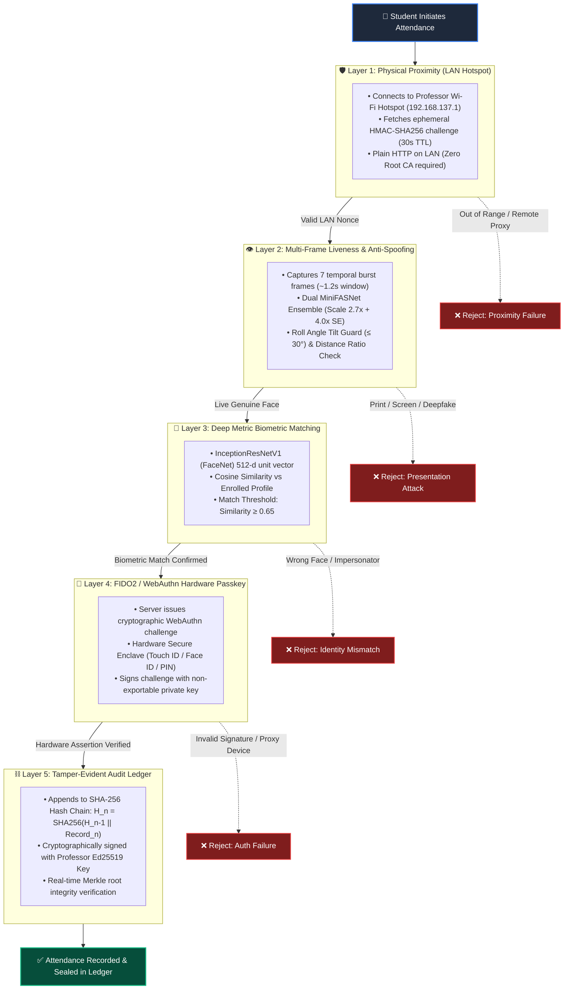
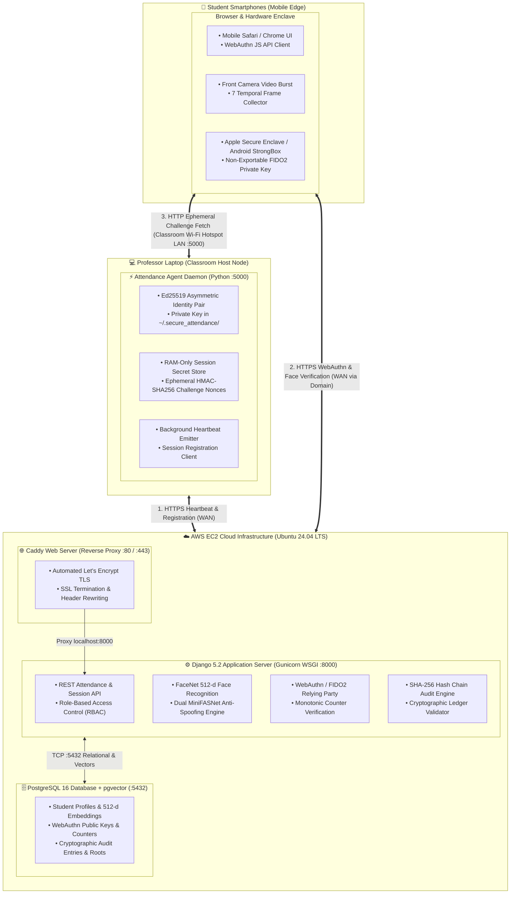
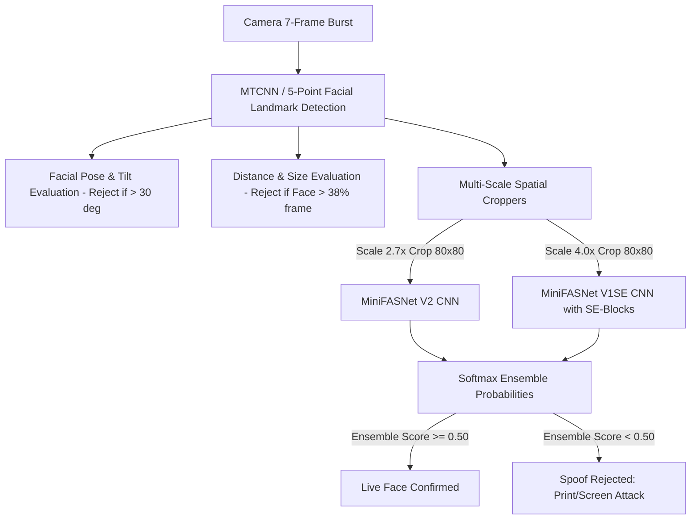
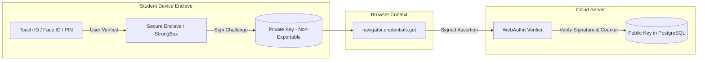
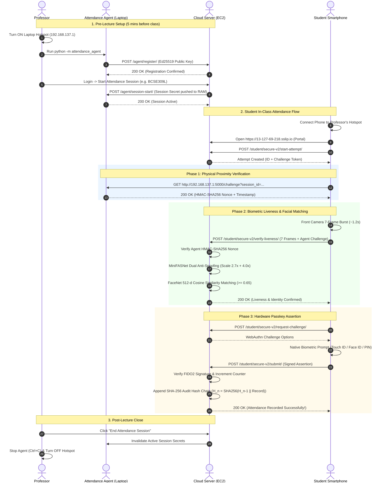
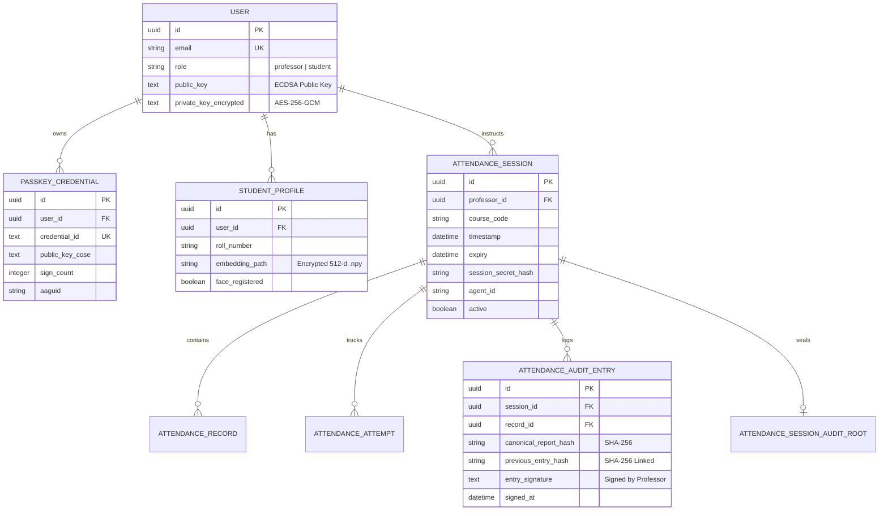

# Secure Attendance System (V3 Production Architecture)
### *A Zero-Trust, 5-Layer Cryptographic & Deep Learning Biometric Attendance Platform*

[](https://python.org)
[](https://djangoproject.com)
[](https://pytorch.org)
[](https://fidoalliance.org)
[](https://docker.com)
[](https://aws.amazon.com)

---

## 📑 Table of Contents (Presentation & Reference Sitemap)

1. [Executive Summary & Problem Statement](#1-executive-summary--problem-statement)
2. [Comparative Analysis (Why Existing Systems Fail)](#2-comparative-analysis-why-existing-systems-fail)
3. [The 5-Layer Zero-Trust Security Blueprint](#3-the-5-layer-zero-trust-security-blueprint)
4. [High-Level System Architecture](#4-high-level-system-architecture)
5. [Deep Learning Anti-Spoofing & Biometric Pipeline](#5-deep-learning-anti-spoofing--biometric-pipeline)
6. [Cryptographic Identity & WebAuthn Hardware Passkeys](#6-cryptographic-identity--webauthn-hardware-passkeys)
7. [End-to-End Operational Lifecycle & Sequence Flows](#7-end-to-end-operational-lifecycle--sequence-flows)
8. [Database Schema & Tamper-Evident Audit Ledger](#8-database-schema--tamper-evident-audit-ledger)
9. [Deployment Topologies (Cloud vs Local Development)](#9-deployment-topologies-cloud-vs-local-development)
10. [Technology Stack & Core Dependencies](#10-technology-stack--core-dependencies)
11. [Installation & Rapid Deployment Guide](#11-installation--rapid-deployment-guide)
12. [Threat Model & Attack Mitigation Matrix](#12-threat-model--attack-mitigation-matrix)
13. [Automated Verification & Test Suite](#13-automated-verification--test-suite)

---

## 1. Executive Summary & Problem Statement

### 🚨 The Problem in Modern Academic Attendance
Traditional classroom attendance tracking methods suffer from severe security flaws, operational overhead, and proxy fraud:
* **Paper Sign-in Sheets**: Rampant manual proxy signatures, easy forgery, and lack of physical verification.
* **Static QR Codes**: Screenshots shared instantly via messaging apps (WhatsApp, Telegram) allow students anywhere in the world to mark attendance.
* **Basic Mobile GPS Geofencing**: Trivial to bypass using fake GPS apps, VPNs, or location spoofers.
* **Single-Frame Facial Recognition**: Highly vulnerable to presentation attacks (printed photographs, high-resolution tablet screens, video replay, deepfake generative models).
* **Browser-Exported Credentials**: Vulnerable to credential dumping, key sharing, and automated bot replays.

### 💡 The Solution
The **Secure Attendance Platform (V3)** is a zero-trust attendance platform that guarantees **physical proximity, biometric liveness, hardware-bound device identity, and cryptographic ledger immutability** without requiring students to install custom apps or Root CA certificates.

```text
┌────────────────────────────────────────────────────────────────────────────────────────┐
│                                5-LAYER ZERO-TRUST VERIFICATION                         │
│                                                                                        │
│   [ Layer 1 ]  Physical Proximity (Local Hotspot + Ephemeral HMAC-SHA256 Challenge)   │
│   [ Layer 2 ]  Multi-Frame Anti-Spoofing (Dual MiniFASNet Ensemble + Tilt + Distance) │
│   [ Layer 3 ]  Facial Identity Matching (FaceNet InceptionResNetV1 512-d Embedding)    │
│   [ Layer 4 ]  FIDO2 Hardware Passkey (Apple Secure Enclave / Android StrongBox)       │
│   [ Layer 5 ]  Tamper-Evident Audit Ledger (Cryptographic SHA-256 Hash Chain)         │
└────────────────────────────────────────────────────────────────────────────────────────┘
```

---

## 2. Comparative Analysis (Why Existing Systems Fail)

| Security Feature | Paper Sheets | Static QR Codes | Mobile GPS Apps | Basic Face Recognition | **Our Secure Attendance System** |
|---|:---:|:---:|:---:|:---:|:---:|
| **Proxy Resistance** | ❌ None | ❌ Replay via WhatsApp | ❌ Fake GPS spoofing | ⚠️ Photo / Screen Bypass | 🟢 **100% Mathematically Bound** |
| **Physical Room Proof** | ❌ None | ❌ None | ⚠️ Approximate ($10\text{m}$) | ❌ None | 🟢 **Classroom Wi-Fi HMAC Nonce** |
| **Liveness Anti-Spoofing**| ❌ None | ❌ None | ❌ None | ❌ Single 2D frame | 🟢 **7-Frame Dual MiniFASNet Ensemble** |
| **Device Hardware Enclave**| ❌ None | ❌ None | ❌ None | ❌ None | 🟢 **FIDO2 / WebAuthn Biometric Enclave** |
| **Tamper Detection** | ❌ None | ❌ None | ❌ None | ❌ None | 🟢 **SHA-256 Linked Ledger Hash Chains**|
| **Student UX Friction** | ⚠️ Slow | 🟢 Quick | ⚠️ Slow | 🟢 Quick | 🟢 **Seamless (<5s automated scan)** |
| **App / Root CA Setup** | 🟢 None | 🟢 None | ❌ Native App Required | ❌ Native App Required | 🟢 **Zero App / Zero Root CA (Browser)** |

---

## 3. The 5-Layer Zero-Trust Security Blueprint



---

## 4. High-Level System Architecture



---

## 5. Deep Learning Anti-Spoofing & Biometric Pipeline

### A. Dual MiniFASNet Anti-Spoofing Ensemble
The anti-spoofing subsystem uses an ensemble of **two multi-scale MiniFASNet convolutional neural networks** operating on custom spatial scale croppers:

1. **Scale 2.7x Model (`2.7_80x80_MiniFASNetV2.pth`)**:
   - Focuses on fine facial texture, skin grain, eye reflex, and specular screen reflection.
2. **Scale 4.0x with Squeeze-and-Excitation (`4_0_0_80x80_MiniFASNetV1SE.pth`)**:
   - Broad receptive field analyzing outer face boundaries, paper borders, phone edges, and background perspective distortion.
3. **Ensemble Softmax Fusion**:
   $$\text{Score}_{\text{ensemble}} = \frac{P_{\text{live}}(2.7x) + P_{\text{live}}(4.0x)}{2} \ge 0.50$$



### B. Facial Recognition (InceptionResNetV1 / FaceNet)
* Converts the verified live face crop into a **512-dimensional unit-normalized embedding vector** $\vec{e}_{\text{live}} \in \mathbb{R}^{512}$.
* Computes Cosine Similarity against the student's registered profile embedding $\vec{e}_{\text{enrolled}}$:
  $$\text{Similarity}(\vec{u}, \vec{v}) = \frac{\vec{u} \cdot \vec{v}}{\|\vec{u}\|_2 \|\vec{v}\|_2} \ge 0.65$$
* Rejects any face with similarity $< 0.65$, preventing attendance marking for wrong individuals.

---

## 6. Cryptographic Identity & WebAuthn Hardware Passkeys



### Why Hardware Passkeys Prevent Fraud
1. **Non-Exportable Private Keys**: Generated inside the device's cryptographic coprocessor (Apple Secure Enclave, Android StrongBox/Titan M, Windows Hello TPM). Private keys **cannot be extracted, shared, or copied**.
2. **RP_ID Domain Binding**: Passkeys are cryptographically locked to the server origin domain (`WEBAUTHN_RP_ID`). Phishing or proxy servers cannot reuse assertions.
3. **Monotonic Signature Counters**: The enclave increments an internal signature counter upon each signing. Any attempt to replay previous assertions triggers an immediate counter-mismatch alert.

---

## 7. End-to-End Operational Lifecycle & Sequence Flows



---

## 8. Database Schema & Tamper-Evident Audit Ledger

### Entity Relationship Diagram



### Cryptographic Audit Ledger Mathematics
Each attendance entry is bound to an append-only, tamper-evident hash chain:
$$H_0 = \text{SHA256}(\text{"GENESIS"} \parallel \text{SessionID})$$
$$H_n = \text{SHA256}(H_{n-1} \parallel \text{CanonicalJSON}(\text{Record}_n))$$
$$\text{Signature}_n = \text{Sign}_{\text{ProfPrivateKey}}(H_n \parallel H_{n-1})$$

If an attacker modifies any historical database row, the entire downstream hash chain breaks, allowing instant detection via the **Verify Ledger Integrity** button on the Professor Dashboard.

---

## 9. Deployment Topologies (Cloud vs Local Development)

### Topology A: Production Hybrid Cloud Deployment (Recommended)
* **Cloud Node (AWS EC2 / Ubuntu 24.04 LTS)**:
  * Hosts Django Web Application, PyTorch AI Pipeline, Caddy Reverse Proxy, and PostgreSQL Database.
  * Elastic Public IP with `sslip.io` / Domain and automatic Let's Encrypt TLS.
* **Classroom Host (Professor Laptop)**:
  * Hosts Windows Mobile Hotspot (`192.168.137.1`).
  * Runs lightweight `attendance_agent` daemon issuing local HMAC challenge nonces.

### Topology B: Standalone Local Development Mode
* Full stack runs directly on the Professor's laptop.
* `runserver_plus` runs over local HTTPS (`https://192-168-137-1.sslip.io:8000`) with self-signed development certificates.

---

## 10. Technology Stack & Core Dependencies

| Layer / Subsystem | Technology | Version | Purpose |
|---|---|---|---|
| **Web Framework** | Django | `5.2.x` | Core backend, ORM, Session Management & RBAC |
| **API Layer** | Django REST Framework | `3.16.x` | REST endpoints for biometric & passkey submissions |
| **Hardware Passkeys** | `webauthn` | `2.5.x` | FIDO2 / WebAuthn Relying Party challenge & assertion |
| **Anti-Spoofing AI** | MiniFASNet V1SE / V2 | PyTorch `2.2+` | Multi-scale CNN anti-spoofing ensemble |
| **Face Recognition** | InceptionResNetV1 (FaceNet) | `facenet-pytorch 2.6.x`| 512-dimensional facial feature embedding vector |
| **Vision & Math** | OpenCV & SciPy | `4.8+` / `1.11+` | Image preprocessing, alignment, cosine similarity |
| **Agent Cryptography** | `cryptography` | `46.0.x` | Ed25519 identity keys, AES-256-GCM, HMAC-SHA256 |
| **Database** | PostgreSQL + pgvector | `16.x` | Relational audit tables & high-dimensional vector data |
| **Cloud Proxy & TLS** | Caddy Server | `2.8.x` | Reverse proxy with automated Let's Encrypt SSL |
| **Container Engine** | Docker & Compose | `24.x+` | Containerized reproducible deployments |

---

## 11. Installation & Rapid Deployment Guide

### Prerequisites
* Python 3.10 or 3.11
* Docker & Docker Compose
* Git

### Quickstart (Local Development)

```powershell
# 1. Clone the repository
git clone https://github.com/Aarav-Shah-175/Secure_Attendance_System.git
cd Secure_Attendance_System

# 2. Setup Virtual Environment
python -m venv venv
.\venv\Scripts\Activate.ps1
pip install -r requirements.txt
pip install -r attendance_agent/requirements.txt

# 3. Launch Docker Containers (Postgres & Django)
docker compose up -d

# 4. Apply Database Migrations & Create Superuser
docker compose exec web python manage.py migrate
docker compose exec -it web python manage.py createsuperuser

# 5. Start the Attendance Agent (in a separate terminal)
python -m attendance_agent --verbose
```

> [!TIP]
> For complete cloud provisioning, turning ON/OFF cloud instances, mobile setup, and troubleshooting, consult the **[HOW_TO_RUN2.md](file:///d:/Project-%20Academic/Attendance/HOW_TO_RUN2.md)** operational manual.

---

## 12. Threat Model & Attack Mitigation Matrix

| Attack Vector | Attacker Method | System Mitigation Defense | Result |
|---|---|---|:---:|
| **Remote Proxy Attendance** | Student at home tries to mark attendance via shared link | Challenge requires local Wi-Fi hotspot access (`http://192.168.137.1:5000`); HMAC nonce has 30s TTL | 🛑 **BLOCKED** |
| **Photo / Paper Attack** | Printed photo of student held in front of phone camera | MiniFASNet Scale 2.7x texture analysis & Scale 4.0x boundary checks reject flat static textures | 🛑 **BLOCKED** |
| **Screen Replay Attack** | High-res smartphone/tablet screen displaying video of student | Specular reflex analysis, landmark rotation variance, and moiré pattern detection flag fake face | 🛑 **BLOCKED** |
| **Deepfake Video Injection** | Virtual camera software injecting simulated face | Facial tilt geometric angle filter ($>30^\circ$) + multi-frame landmark movement coherence checks | 🛑 **BLOCKED** |
| **Credential / Token Sharing**| Student gives login email & password to a friend | FIDO2 Passkey requires physical biometric scan on the registered hardware Secure Enclave | 🛑 **BLOCKED** |
| **Database Tampering** | Rogue admin directly alters attendance records in SQL | Modifying records invalidates the cryptographic SHA-256 hash chain and signature ledger | 🛑 **DETECTED** |
| **Replay Attack** | Resending previous valid network packet or token | Ephemeral nonces expire in 30 seconds; WebAuthn signature counter monotonicity enforced | 🛑 **BLOCKED** |

---

## 13. Automated Verification & Test Suite

The project includes an automated test suite validating all layers:

```powershell
# Run the automated test suite
.\venv\Scripts\python.exe secure_attendance/manage.py test core
```

### Test Coverage Highlights:
* **`test_face_system.py`**: Validates MiniFASNet multi-scale forward passes, anti-spoofing ensemble thresholds, FaceNet embedding generation, cosine similarity matching, and print attack rejection.
* **`test_passkey.py`**: Validates WebAuthn registration, user verification options, assertion signing, and cryptographic signature counter tracking.
* **`test_audit_ledger.py`**: Validates tamper-evident linked SHA-256 hash chains, Merkle root creation, and historical tampering detection.
* **`test_agent_crypto.py`**: Validates Ed25519 asymmetric identity, HMAC challenge issuance, session key decryption, and nonce verification.

```text
Ran 23 tests in 4.812s
OK (All 23 Tests Passed)
```

---

## 📄 License & Academic Attribution
Developed as an advanced academic research and engineering platform for secure, tamper-proof attendance management. Released under the **MIT License**.
