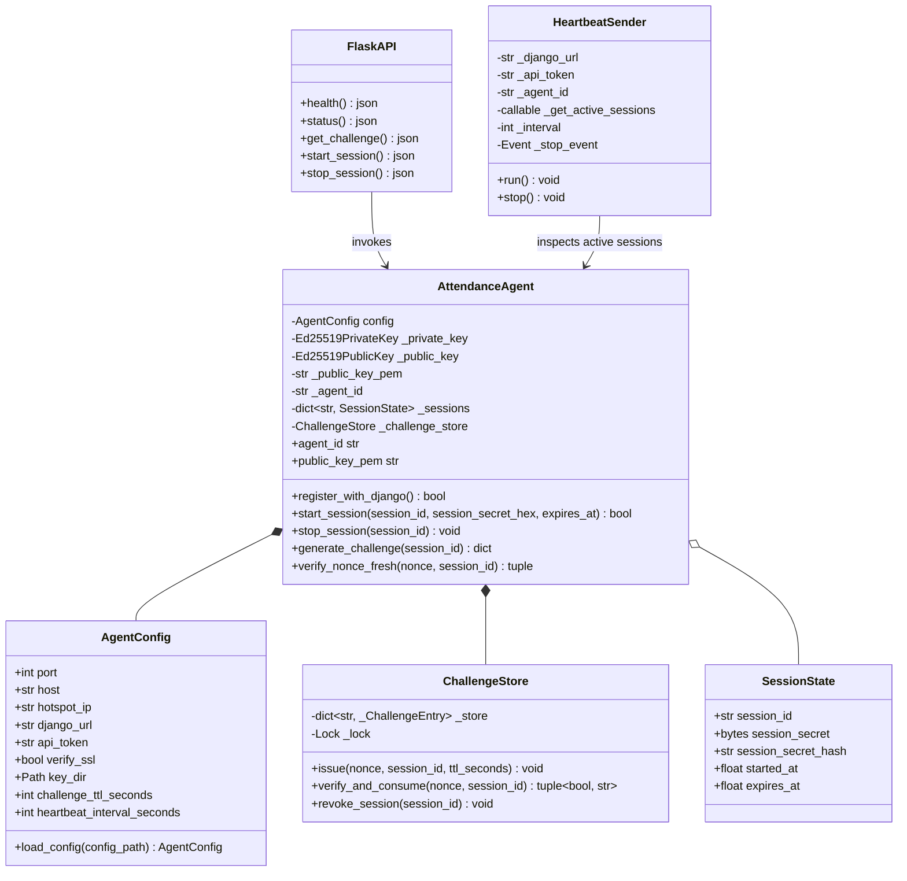
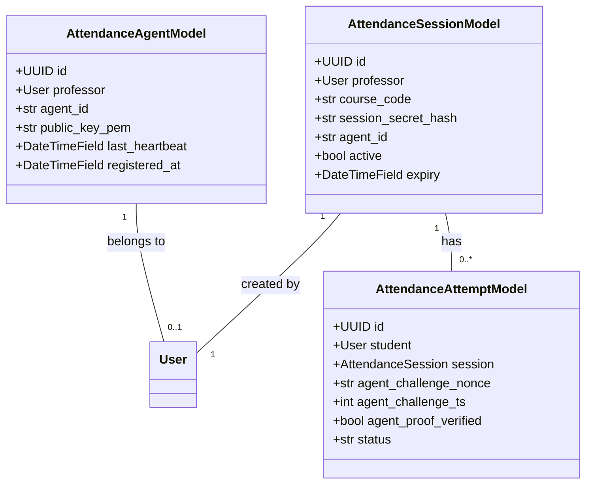

# Class Diagrams — Attendance Agent Component Architecture

```mermaid
classDiagram
    class AgentConfig {
        +int port
        +str host
        +str hotspot_ip
        +str django_url
        +str api_token
        +bool verify_ssl
        +Path key_dir
        +int challenge_ttl_seconds
        +int heartbeat_interval_seconds
        +load_config(config_path) AgentConfig
    }

    class AttendanceAgent {
        -AgentConfig config
        -Ed25519PrivateKey _private_key
        -Ed25519PublicKey _public_key
        -str _public_key_pem
        -str _agent_id
        -dict~str, SessionState~ _sessions
        -ChallengeStore _challenge_store
        +agent_id str
        +public_key_pem str
        +register_with_django() bool
        +start_session(session_id, session_secret_hex, expires_at) bool
        +stop_session(session_id) void
        +generate_challenge(session_id) dict
        +verify_nonce_fresh(nonce, session_id) tuple
    }

    class SessionState {
        +str session_id
        +bytes session_secret
        +str session_secret_hash
        +float started_at
        +float expires_at
    }

    class ChallengeStore {
        -dict~str, _ChallengeEntry~ _store
        -Lock _lock
        +issue(nonce, session_id, ttl_seconds) void
        +verify_and_consume(nonce, session_id) tuple~bool, str~
        +revoke_session(session_id) void
    }

    class HeartbeatSender {
        -str _django_url
        -str _api_token
        -str _agent_id
        -callable _get_active_sessions
        -int _interval
        -Event _stop_event
        +run() void
        +stop() void
    }

    class FlaskAPI {
        +health() json
        +status() json
        +get_challenge() json
        +start_session() json
        +stop_session() json
    }

    AttendanceAgent *-- AgentConfig
    AttendanceAgent *-- ChallengeStore
    AttendanceAgent o-- SessionState
    FlaskAPI --> AttendanceAgent : invokes
    HeartbeatSender --> AttendanceAgent : inspects active sessions
```

---

## Django Integration Models

```mermaid
classDiagram
    class AttendanceAgentModel {
        +UUID id
        +User professor
        +str agent_id
        +str public_key_pem
        +DateTimeField last_heartbeat
        +DateTimeField registered_at
    }

    class AttendanceSessionModel {
        +UUID id
        +User professor
        +str course_code
        +str session_secret_hash
        +str agent_id
        +bool active
        +DateTimeField expiry
    }

    class AttendanceAttemptModel {
        +UUID id
        +User student
        +AttendanceSession session
        +str agent_challenge_nonce
        +int agent_challenge_ts
        +bool agent_proof_verified
        +str status
    }

    AttendanceSessionModel "1" -- "0..*" AttendanceAttemptModel : has
    AttendanceAgentModel "1" -- "0..1" User : belongs to
    AttendanceSessionModel "1" -- "1" User : created by
```
