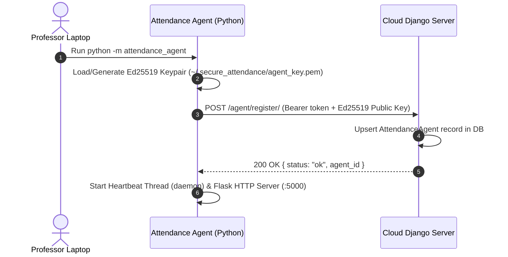
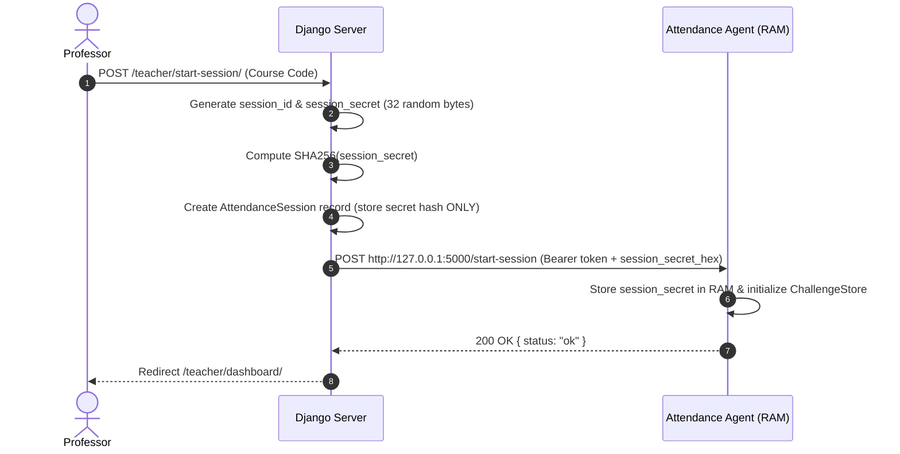
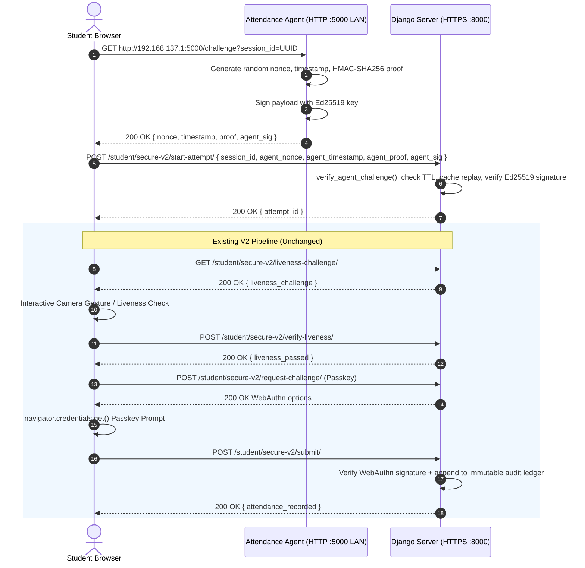
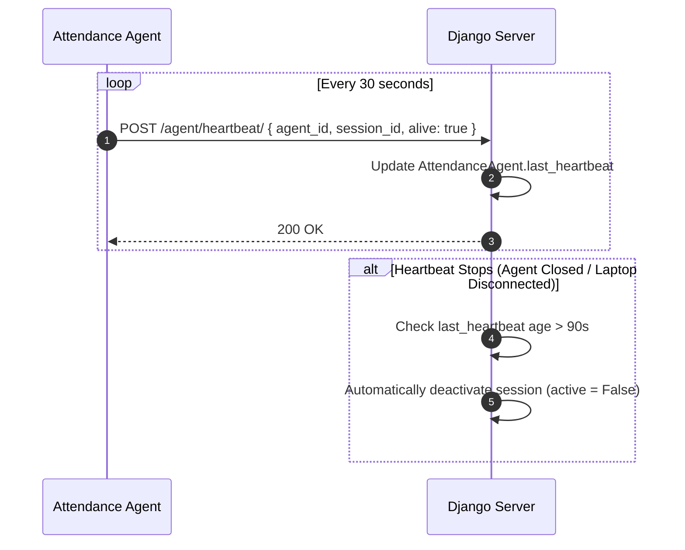

# Sequence Diagrams — Secure Presence V2 Network Architecture Redesign

## 1. Agent Launch & Identity Registration

---

## 2. Session Initialization Flow

---

## 3. Student Attendance Marking Flow

---

## 4. Heartbeat & Session Teardown

