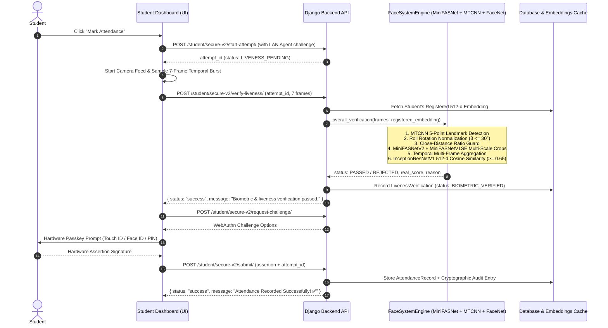

# Production Face & Liveness Detection Migration Walkthrough

The production face recognition and anti-spoofing pipeline has been migrated to the unified deep-learning system combining **MTCNN Face Detection & Landmark Alignment**, **InceptionResNetV1 (VGGFace2)**, and an **Ensemble MiniFASNet Anti-Spoofing Architecture** (MiniFASNetV2 scale 2.7 + MiniFASNetV1SE scale 4.0).

---

## 1. Architecture Flow



---

## 2. Key Components Created & Updated

### A. New Face System Module (`secure_attendance/core/face_system/`)
1. **[models.py](file:///d:/Project-%20Academic/Attendance/secure_attendance/core/face_system/models.py)**:
   - PyTorch neural network architectures: `MiniFASNet`, `MiniFASNetSE`, `Residual`, `ResidualSE`, `Depth_Wise`, `Depth_Wise_SE`, `Conv_block`, `Linear_block`, `SEModule`.
   - Multi-scale cropper: `CropImage` with safe boundary clamping for scale 2.7 (80x80) and scale 4.0 (80x80).
   - `OpenCVFaceDetector` fallback face detector.
2. **[engine.py](file:///d:/Project-%20Academic/Attendance/secure_attendance/core/face_system/engine.py)**:
   - `FaceSystemEngine` thread-safe singleton manager.
   - Device auto-selection (`cuda` if available, fallback to optimized `cpu`).
   - Preprocessing guards:
     - 5-point facial landmark roll angle $\theta$ calculation.
     - Extreme unnatural tilt detection ($|\theta| > 30^\circ$) flagged as replay attack.
     - Affine rotation warp normalization ($3^\circ < |\theta| \le 30^\circ$) to upright $0^\circ$.
     - Close-range distance anomaly guard (`area_ratio > 0.38` or `bh > 0.65*h`).
   - MiniFASNet multi-scale ensemble forward pass & temporal multi-frame aggregation.
   - 512-dim InceptionResNetV1 face recognition & normalized cosine similarity matching.
3. **Model Weights** (`secure_attendance/core/face_system/weights/`):
   - `2.7_80x80_MiniFASNetV2.pth`
   - `4_0_0_80x80_MiniFASNetV1SE.pth`

### B. Core Liveness & Biometric Verification
1. **[liveness.py](file:///d:/Project-%20Academic/Attendance/secure_attendance/core/liveness.py)**:
   - `ProductionFaceLivenessVerifier` implementation conforming to the `LivenessVerifier` protocol.
   - Parses multi-frame temporal bursts (or single-frame fallbacks) from base64/JSON.
   - Integrates with `FaceEmbeddingCache` and database fallback for student profile retrieval.
   - Returns structured `LivenessDecision` with clear reason codes.
2. **[student_service.py](file:///d:/Project-%20Academic/Attendance/secure_attendance/core/student_service.py)**:
   - Updated `register_student_face_embedding` and `verify_student_face` to use `FaceSystemEngine`.
   - Preserved existing 512-dim L2-normalized vector format, maintaining 100% backward compatibility with registered embeddings.
3. **[views.py](file:///d:/Project-%20Academic/Attendance/secure_attendance/core/views.py)**:
   - Cleaned up duplicate imports.
   - Updated `/student/register-face/`, `/student/face-verify/`, and `/student/secure-v2/verify-liveness/` to use the new engine.

### C. Frontend UI & Camera Flow
1. **[student_dashboard.html](file:///d:/Project-%20Academic/Attendance/secure_attendance/core/templates/student_dashboard.html)**:
   - Replaced client-side MediaPipe gesture challenge with a 7-frame temporal burst camera capture (~1.2 seconds sampling).
   - Real-time scanning animation overlay and user guidance.
   - Removed external CDN script dependencies (`@mediapipe/face_mesh`, `@mediapipe/camera_utils`), reducing load time and dependencies.

### D. Docker & Deployment Configuration
1. **[Dockerfile](file:///d:/Project-%20Academic/Attendance/secure_attendance/Dockerfile)**:
   - Copies model weights in `secure_attendance/core/face_system/weights/` directly into the container.
   - Runs CPU-optimized PyTorch and Torchvision.
2. **[docker-compose.yml](file:///d:/Project-%20Academic/Attendance/docker-compose.yml)**:
   - Added `LIVENESS_VERIFIER_TYPE=new_face_system`.
3. **[settings.py](file:///d:/Project-%20Academic/Attendance/secure_attendance/secure_attendance/settings.py)**:
   - Default `LIVENESS_VERIFIER_TYPE = "new_face_system"`.

---

## 3. Test Verification Results

All 23 unit and integration tests passed:
```
Ran 23 tests in 65.292s

OK
Destroying test database for alias 'default'...
Found 23 test(s).
System check identified no issues (0 silenced).
```

### Tests Covered:
- `FaceSystemEngine` singleton loading and weight verification.
- `MiniFASNetV2` & `MiniFASNetV1SE` forward passes.
- `CropImage` 2.7x and 4.0x multi-scale bounding box expansion.
- `extract_face_embedding` normalization.
- `ProductionFaceLivenessVerifier` registration and verification.
- Face match with genuine face -> `PASSED`.
- Face mismatch (wrong person) -> `REJECTED (face_match_below_threshold)`.
- Replay/print spoof attack -> `REJECTED (spoof_detected_replay)`.
- No face in frame -> `REJECTED (no_face_detected)`.
- Unregistered student -> `REJECTED (face_not_registered)`.
- Full end-to-end Secure Presence V2 lifecycle.
